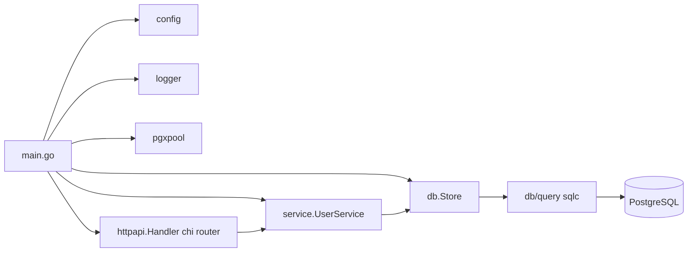
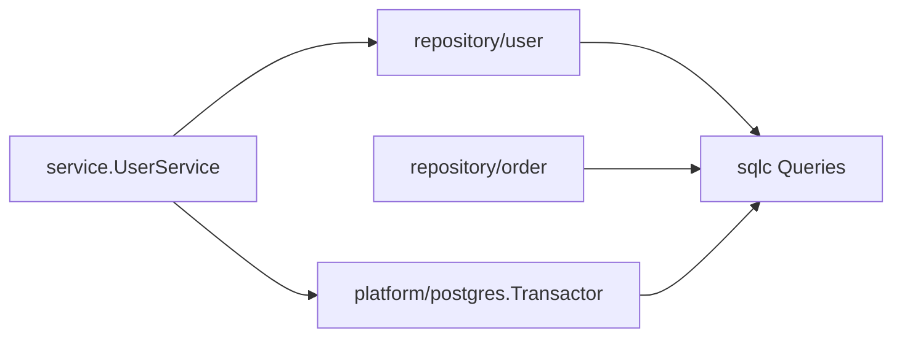

# scaffold-go 架构重构 TODO

基于对当前代码库的走查，本文档汇总架构层面的改进建议，按优先级分组。未涉及功能新增，仅聚焦于可扩展性、可测试性与生产就绪度。

## 当前架构速览



整体分层 `handler -> service -> store -> sqlc` 思路清晰，显式装配、无隐式魔法。以下问题主要在 "当资源从 1 个扩展到 5、20 个时" 才会暴露。

---

## 高优先级（High）

### 1. 解耦 transport DTO 与 service 包

**现状**：`CreateUserInput` / `UpdateUserInput` / `PatchUserInput` 定义在 [internal/service/user_service.go](internal/service/user_service.go)，同时携带 `validate:"..."` 和 `example:"..."` 标签，使 service 包耦合了 `go-playground/validator` 与 swaggo。同时 handler 在 [internal/http/user_handler.go](internal/http/user_handler.go) 直接把 sqlc 生成的 `query.User` 暴露到 HTTP 响应里。

**建议**：

- 把请求 / 响应 DTO 与 validator 调用下沉到 `internal/http`（或 `internal/api`）。
- 引入领域模型 `internal/domain/user.go`，使用纯 Go 类型（不含 `pgtype.Text`、`pgtype.Date`，不含 `validate` 标签）。
- service 接收与返回领域类型；在 handler 与 repository 各自写一层 mapper 做 DTO <-> domain、domain <-> sqlc row 的转换。

**收益**：DB 列变化、sqlc 替换、HTTP schema 调整不再跨层蔓延。

### 2. 拆掉整体式 `Store`，改为按资源的 repository

**现状**：[internal/db/store.go](internal/db/store.go) 把所有查询方法集中在一个 `Store`，新加资源就要不断加方法，最终会变成 God Object。service 中的 `UserStore` interface（[internal/service/user_service.go](internal/service/user_service.go) L87-94）本身是健康的消费方定义接口，应保留。

**建议**：

- 删除薄薄一层代理的 `Store`，在 `internal/repository/user/` 下实现基于 `query.Queries` 的 repository。
- 把连接池与事务 helper 移到 `internal/platform/postgres/`（顺便把 `internal/db` 改名）。
- 把 `WithTx` 从 `Store` 剥离到独立的 `Transactor` 抽象，让 service 可以组合多 repo 事务，而不感知 `pgx`。



### 3. 收敛校验逻辑；简化 PATCH

**现状**：[internal/service/user_service.go](internal/service/user_service.go) L212-297 的 PATCH 路径绕开了 validator，手写长度、邮箱校验；`OptionalString` 自定义可空包装紧挨着业务逻辑。

**建议**：

- HTTP 层定义统一的 PATCH DTO，复用 validator 标签（`omitempty,email,max=255`）。
- 把 `OptionalString` 抽到 `internal/pkg/nullable`（或类似公共包），便于复用。
- service 只接收已通过校验的领域结构，专注合并与业务规则。

### 4. 加入可观测性基础设施

**现状**：只有请求日志，无指标、无链路追踪；[internal/http/router.go](internal/http/router.go) L82-85 的 `/healthz` 即便数据库挂了也会返 200。

**建议**：

- 拆分健康检查：`/livez`（进程存活）+ `/readyz`（调用 `pool.Ping(ctx)` 校验依赖）。
- 暴露 `/metrics`（Prometheus），使用 `chi-prometheus` 或 `promhttp`，附加按路由的请求计数、错误计数、耗时直方图。
- 接入 OpenTelemetry：HTTP 侧用 `otelhttp`，DB 侧用 `otelpgx` 作为 `pgx.Tracer`；将 trace_id、request_id 通过 `context.Context` 贯穿。
- 在 `RequestLogger`（[internal/http/middleware.go](internal/http/middleware.go)）里把 request 级别的 `*slog.Logger` 放入 ctx，让下游日志自动带上 `request_id`、`trace_id`、`user_id`。

### 5. 加固 HTTP 边界

**现状**：[internal/http/router.go](internal/http/router.go) / [internal/http/middleware.go](internal/http/middleware.go) 的几个生产化缺口：

- 请求体无大小限制 —— `json.NewDecoder` 之前应包一层 `http.MaxBytesReader`（例如 1 MiB）。
- `json.Decoder.DisallowUnknownFields()` 未启用，未知字段被静默吞掉。
- 无超时中间件 —— 建议加 `chi/middleware.Timeout`，并在 DB 调用处独立 `context.WithTimeout`（独立于 HTTP server 的 `WriteTimeout`）。
- 无限流 —— 写接口至少加一层 `httprate`。
- CORS 配置：`OptionsPassthrough: true` + 自定义 `PreflightNoContent`（[internal/http/middleware.go](internal/http/middleware.go) L46-54）重复且脆弱，建议去掉自定义预检，交给 `go-chi/cors`；同时考虑 `ExposedHeaders: ["X-Request-Id"]`。

### 6. pgx 连接池调优与查询追踪

**现状**：[internal/db/db.go](internal/db/db.go) 使用 `pgxpool.New` 的默认参数。

**建议**：

- 改用 `pgxpool.ParseConfig(dsn)`，显式设置 `MaxConns`、`MinConns`、`MaxConnLifetime`、`MaxConnIdleTime`、`HealthCheckPeriod`。
- 接入 `QueryTracer`（otelpgx 或自定义 slog tracer）记录慢查询并带上 request_id。
- 通过环境变量暴露关键参数：`DB_MAX_CONNS`、`DB_MAX_CONN_LIFETIME` 等。

### 7. 抽出 `App` 聚合，使 `main.go` 轻量且可测

**现状**：[main.go](main.go) 的 `run()` 把装配与生命周期混在一起，无法做端到端集成测试。

**建议**：

- 新增 `internal/app/app.go`：`type App struct { cfg, logger, pool, server }`，提供 `New(ctx, cfg)` / `Run(ctx)` / `Close(ctx)`。
- `main.go` 精简到 ~15 行。
- 集成测试可通过 testcontainers 启 Postgres，再 `App.New(...)` 拉起整套服务，直接用 HTTP 客户端验证。

### 8. 重命名 `internal/http`，消除包名冲突

**现状**：目录名 `internal/http` 与包名 `httpapi` 不一致，且因为和 stdlib `net/http` 冲突，多处把 stdlib 重命名为 `stdhttp`。

**建议**：目录改名为 `internal/transport/http`（包名仍可为 `httpapi`）或 `internal/api`，并移除 `stdhttp` 别名。

---

## 中优先级（Medium）

- **Config 形状**。[internal/config/config.go](internal/config/config.go) 当前扁平，建议拆成嵌套子结构：`HTTP`、`DB`、`Log`、`Observability`；`ReadTimeout`、`WriteTimeout`、`ShutdownTimeout` 目前写死，应通过环境变量暴露。
- **过期配置文件**。[configs/config.yaml](configs/config.yaml) 与 "纯环境变量" 的新设计相悖，建议删除或明确标注为参考示例。
- **响应时间格式**。[internal/http/user_handler.go](internal/http/user_handler.go) L275-277 使用 `http.TimeFormat`（RFC1123）序列化 JSON 时间字段；客户端普遍期望 RFC3339，建议改为 `time.RFC3339Nano`。
- **分页模型**。[db/query/users.sql](db/query/users.sql) 采用 OFFSET 分页，数据量大时性能恶化；脚手架默认可提供 keyset（cursor）分页，或在文档中标注权衡。
- **`uid` 与 `id` 语义重叠**。`id` 是 `BIGSERIAL`，`uid` 由外部提供并唯一。多数 API 只对外暴露不透明 ID，二选一并保持一致更干净。
- **鉴权骨架缺失**。当前完全没有 auth plumbing。即便不内置鉴权，也应预留示例：`RequireUser` 中间件、`ctxUser` / `ctxAuth` 辅助函数，避免每个使用方各自发明。
- **集成测试**。`make test` 只跑单元测试。建议新增 `make test-integration`，使用 `testcontainers-go` 起 Postgres，覆盖迁移与真实 CRUD。
- **CI 流水线**。仓库未包含 `.github/workflows`。建议加入 `golangci-lint`、`go vet`、`go test -race`、`make swagger-check` 等必选检查。

---

## 低优先级（Low）

- Dockerfile：Go 版本从 `1.22.12` 升到 `1.23.x` 稳定版，base 镜像跟随 alpine 新版；补 `HEALTHCHECK`。
- 确认 `.gitignore` 正确覆盖 `.env.dev`（当前 58 字节，内容较少，需审计）。
- `build.sh` / `run.sh` 的逻辑可用 `docker compose` 更清晰地表达本地联调。
- 待 DTO 从 `service` 移出后，拆分 [internal/http/doc_types.go](internal/http/doc_types.go) 为 `dto.go`。

---

## 目标目录结构（建议）

```
cmd/scaffold-api/main.go
internal/
  app/                  # App 装配 + 优雅生命周期
  config/
  logger/
  platform/
    postgres/           # pool, tracer, transactor
    observability/      # otel, prom
  transport/
    http/               # chi 路由、中间件、DTO、错误映射
      user/             # user_handler.go, dto.go
  domain/
    user/               # 领域实体与校验规则（无 tag）
  service/
    user/               # 业务规则，依赖 repository 接口
  repository/
    user/               # 基于 sqlc 的领域 repo 实现
db/
  migrations/
  query/
internal/db/query/      # sqlc 生成（保持不变）
docs/                   # swagger
```

---

## 分阶段执行建议

可按以下三档之一推进，避免一次性大改：

- **A. 最小硬化**：仅做第 4、5、6 项（健康检查 / 指标、HTTP 边界、pgx 调优）。不改目录结构。
- **B. 分层重构**：做第 1、2、3、7、8 项。改包结构与 DTO 归属。
- **C. 全量**：A + B + 中优先级全部项。

每次改动建议独立 PR，并附：

- 行为变更说明
- 新增 / 变更的环境变量或迁移
- 本地验证命令（如 `make test`、`make swagger-check`）
